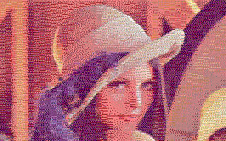
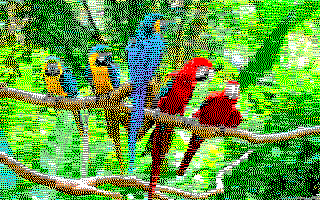

# png2mo5

https://github.com/user-attachments/assets/ce33dc24-45bc-4362-9a23-4df7d69dfb26

Convert any PNG into something a 1984 Thomson MO5 can actually display.

The MO5 has a fixed 16-color palette and a brutal constraint: each group of 8 horizontal pixels can only use 2 colors. That's it. No tricks, no workarounds, just 2 colors per block.

And the palette looks like this:


The converter works in CIELAB perceptual color space — it brute-forces all 136 possible color pairs for every 8-pixel block, simulating Floyd-Steinberg error diffusion inside each candidate to find the pair that minimizes outgoing perceptual error. Then it commits the winner and diffuses the quantization error (damped ~90%) across the image. The result is surprisingly good for 16 KB of video RAM.

C++23. Single-file tools. No dependencies beyond stb headers and a ZX0 compressor.

## Examples

| Original | MO5 (320×200, 16 colors, 2 per block) |
|----------|----------------------------------------|
|  |  |
|  |  |

Compressed sizes (ZX0, from 16 KB raw):

| Image | `.mo5z` size |
|-------|-------------|
| lena  | 10.3 KB     |
| birds | 12.6 KB     |

The `.mo5z` format splits color and pixel data into three separate ZX0-compressed streams — colors first, so a viewer on real hardware can progressively reveal the image during decompression.

## What's in the repo

| Tool | What it does |
|------|-------------|
| **png2mo5** | Image -> MO5. Handles resize, palette quantization, dithering, outputs raw bins + preview PNG |
| **mo5z** | Compresses MO5 pixel+color banks into a single `.mo5z` file (three ZX0 streams) |
| **mo5z2png** | Decompresses a `.mo5z` back to a viewable PNG |
| **k7tool** | Creates and inspects `.k7` cassette tape images for the MO5 |
| **mo5zviewer** | 6809 assembly viewer (309 bytes) — boots from tape, decompresses, displays. That's it |

The full pipeline: `png2mo5` -> `mo5z` -> `k7tool` bundles the viewer + compressed image into a `.k7` cassette file you can load in an emulator.

## Doing your own images

```bash
# 0. (optional) Preview the conversion before committing
#    -> lena_preview.png (preview is the default, no flags needed)
png2mo5/png2mo5 lena.png

# 1. Convert PNG to MO5 raw banks (8000 bytes each)
#    -> lena_pixels.bin, lena_colors.bin
png2mo5/png2mo5 lena.png --bin

# 2. Compress into a .mo5z (three ZX0 streams, ~10 KB)
#    -> lena.mo5z
mo5z/mo5z lena_pixels.bin lena_colors.bin -o lena

# 3. Glue the viewer + compressed image into a single binary
#    -> lena.bin (stanalone binary, loads at $2800, exec at $2800)
cat mo5zviewer/mo5zviewer.bin lena.mo5z > lena.bin

# 4. (optional) Wrap it in a .k7 cassette file for use in an emulator
k7tool/k7tool -o lena.k7 lena.bin:0x2800:0x2800
```

